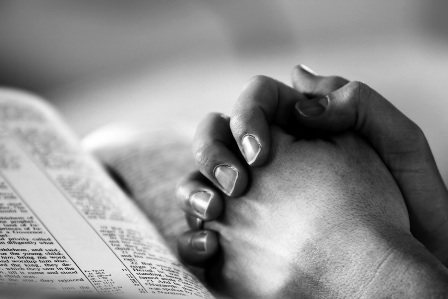

I don't always know what I believe until I write it down.

There's something about putting words on a page that strips away pretense. You can't hide behind a smile or a rehearsed answer when it's just you and the blank page.

Some days the words come easily — grateful, hopeful, steady. Other days they come out tangled and raw, more question than answer.

Both kinds are honest. And I think that's what matters.

I've started thinking of writing as a form of prayer. Not the kind with folded hands and closed eyes. The kind where you open everything up and let it spill out, trusting that Someone is listening even when the words don't make sense.
