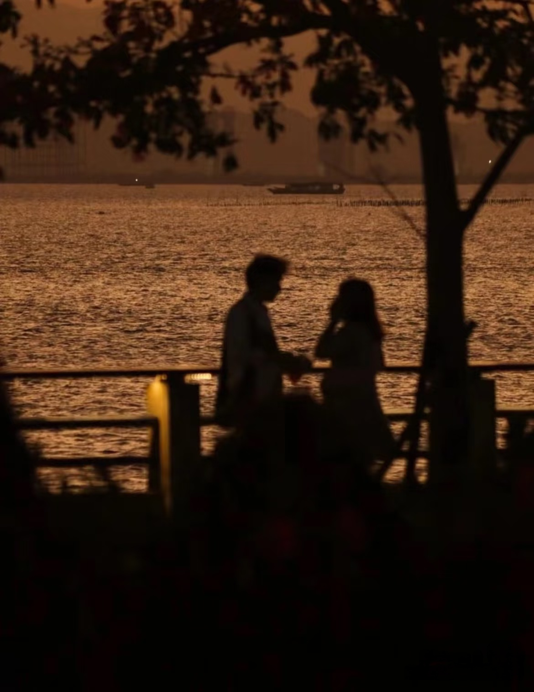

**(I)**

Words spoken while strolling:
three parts carried off by the wind, three parts remembered by the moon,
the remaining four, lit up by the streetlamps, one pool of light after another.

The best conversations are not endless streams of talk,
but walking along together
and suddenly, both stopping at once,

gazing at the same night sky,
with nothing needing to be said.

- - -

**(II)**

The greatest

is when two people pour their own moonlight 

into the same river.

The most precious thing one person can give another is time.

In this noisy world,

those evenings spent walking together
are the softest moonlight I have saved.

- - -

**(III)**

Thoreau said: if a man does not keep pace with his companions, perhaps it is because he hears a different drummer. [^1]

[^1]: Thoreau, Henry David. Walden. Macmillan Collector's Library, 2016.

The one who walks is not the one rushing somewhere, but the one who follows the drumbeat of the heart.

Return time to time. Return you to yourself.

The ancients walked to drink with heaven and earth.
We walk to reunite with ourselves.

- - -

**(IV)**

The shape a city takes in your heart
is not determined by its landmarks,
but by the person you walked it with.

Those winding roads we traveled
shortened the distance to a heartbeat,
and were all drawn into the most secret map within.

Those who can walk together are those who can share solitude:
not needing to speak, not needing excitement, just two people whose silences happen to be on the same frequency.

- - -

**(V)**

A walk is a tenderness that does not chase the clock. The road is slow, the words are slow, the heartbeat too is slow; only memory quietly quickens its pace by a few steps.

Some words cannot be spoken sitting still.
Walking along, they simply fall into the wind and are picked up by the moon.

I break time in half and give you one piece of it.
